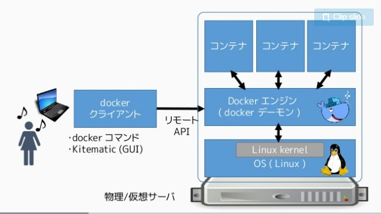

# Dockerとはどのような技術によって動作するのか  
[参考文献：Dockerイメージの理解とコンテナのライフサイクル](https://www.slideshare.net/zembutsu/docker-images-containers-and-lifecycle)

## １．Dockerコンテナ

### Dockerコンテナとは？
* DockerはホストOSのkernel機能を使って複数のルートファイルシステムを実行する  
* その時の**各ルート・ファイルシステム**をコンテナと呼ぶ  
  * コンテナは各種のリソース（プロセス、メモリ、デバイス、ネットワーク）を持つ  

コンテナはDockerエンジンを介して**Linuxカーネルの技術を使う**  
プロセスはホスト上に起動していても、**コンテナ内においてホスト側や他のコンテナを見ることはできない。**

より技術的に表現するならば、**コンテナ内で各ルートディレクトリをマウントしている**、と言える

## ２．Docker Hub

### Docker Hubとは？
Dockerイメージのレポジトリのこと

例えばDocker Terminal上で  
$ docker run hello-world  
と打ち込むと、  
1. DockerエンジンがDocker Hub（レポジトリ）からhello-worldイメージを検索
2. 見つかったhello-worldイメージをダウンロードする。  
3. ダウンロードしたイメージからコンテナを作成、起動する。　　

## ３．Dockerイメージとそれに基づくDockerコンテナ

### Docker イメージとは？  
**コンテナを実行する時に必要なファイルシステム**  
* イメージレイヤが集合することでDockerイメージを構成する
  * 共通するレイヤやイメージ間で共有できるため、**ディスク容量の削減や高いポータビリティを実現する** 
 

レイヤが同一であれば、**以前ダウンロードしたレイヤを使いまわすことができる**
  

DockerコンテナをDockerイメージから説明するならば、  
**読み込み専用のDockerイメージ上に読み書き可能なイメージレイヤを上乗せし、Dockerコンテナを構成する**、ということになる  
  

